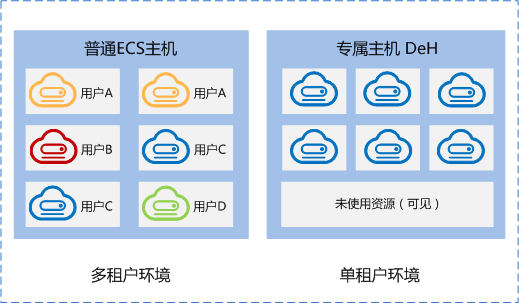

# 专属主机

专属主机（Dedicated Host，简称DeH），是指用户可独享的专属物理主机资源。您可以将云服务器创建在您的专属主机上，从而满足您对隔离性、安全性、性能的更高要求。同时，您还可以在将业务迁移到专属主机时，继续使用迁移前的服务器端软件许可，即支持自带许可（BYOL），达到节省开支、提高对云服务器的自治等目的。

专属主机与普通ECS主机的区别如下图所示。

您作为专属主机的唯一租户，不需要与其他租户共享主机的物理资源，您还可以获取这台服务器的物理属性，包括Sockets、物理内核、CPU类型、内存大小，并根据专属主机规格创建指定规格族的云服务器。

## 自定义部署方式

您可以通过以下两种方式来使用您的专属主机资源：

-   指定一台专属主机来创建云服务器

    您可以在DeH服务中选择一台专属主机来创建云服务器；也可以在ECS服务中创建云服务器时，选择创建到指定的专属主机上。

-   由系统选择一台专属主机来创建云服务器

    您需要在ECS服务中创建云服务器时，选择“自动放置”。

    此时系统会将云服务器创建在符合规格的专属主机中剩余内存最大的那一台上，以使各专属主机尽量均衡负载。

这两种不同的使用方式相结合，既能满足您对所部属应用的隔离性、安全性、合规性等要求，同时也能合理利用资源，使云服务器的性能更优化。

