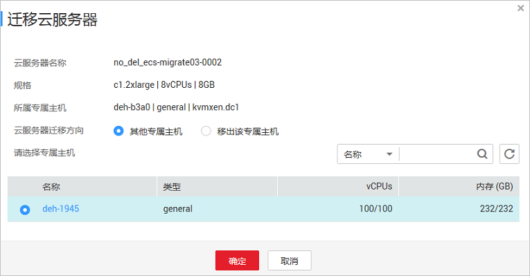

# 专属主机上云服务器迁移

## 操作场景

云服务器可以在专属主机与公共资源池之间迁移，具体包括：

-   将创建在专属主机上的云服务器迁移至其他专属主机。
-   将创建在专属主机上的云服务器迁移至公共资源池，即不再部署在专属主机上。
-   将公共资源池的云服务器迁移至专属主机上，成为专属主机上创建的云服务器。

    > **说明：** 
    >此场景需要在弹性云服务器页面操作，具体请参见《弹性云服务器用户指南》的“[迁移云服务器](https://support.huaweicloud.com/usermanual-ecs/ecs_03_0164.html)”章节。
    >仅支持按需计费的虚拟机迁入专属主机中。

## 迁移须知

关机状态的云服务器才能执行迁移操作。

## 操作步骤

1.  登录管理控制台。
2.  单击管理控制台左上角的，选择区域和项目。
3.  选择“计算 \> 专属主机”。

    进入专属主机信息页面。

4.  在专属主机列表中，单击专属主机的名称。

    进入该专属主机详情页面。

5.  在“专属主机上的云服务器”区域的云服务器列表中，查询待迁移云服务器状态。
6.  如果云服务器状态不是关机状态，单击“操作”中的“更多 \> 关机”。
7.  待云服务器状态变为“关机”状态时，单击“操作”中的“更多 \> 迁移云服务器”。

    **图 1**  迁移云服务器  
    

8.  在“迁移云服务器”页面，根据界面提示执行迁移云服务器操作。
    -   如果是迁移至其他专属主机，请选择“云服务器迁移方向：其他专属主机”。
    -   如果是迁出至公共资源池，请选择“云服务器迁移方向：移出该专属主机”。

9.  单击“确定”，开始迁移云服务器。

    > **说明：** 
    >迁移中云服务器的状态变化与规格变更中云服务器的状态变化一样，由“调整中”变为初始状态“关机”。

