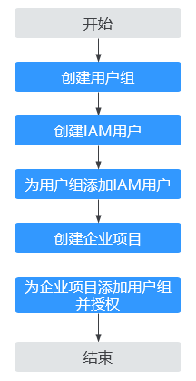

# 企业项目管理

企业项目管理是一种云资源管理方式，将云资源按项目管理，实现项目内的资源管理、成员管理。

专属主机支持企业项目管理，可以赋予不同人员对不同专属主机的管理权限。

## 创建企业项目并授权

在使用企业项目管理专属主机前，需要先按照[图1](#fig13850958203015)创建企业项目并完成授权。详见[《企业管理用户指南》](https://support.huaweicloud.com/usermanual-em/em_eps_qs_0800.html)。

**图 1**  创建企业项目并授权  

## 使用企业项目管理专属主机资源

-   **在购买专属主机时选择企业项目。**详见[购买专属主机](https://support.huaweicloud.com/qs-deh/deh_01_0012.html)。
-   **在“企业项目管理”页面将专属主机资源迁入目标企业项目。**详见[为企业项目迁入资源](https://support.huaweicloud.com/usermanual-em/zh-cn_topic_0108763967.html)。

> **说明：** 
>如需将专属主机从目标企业项目迁出，请参见[迁出企业项目资源](https://support.huaweicloud.com/usermanual-em/zh-cn_topic_0108763973.html)。

