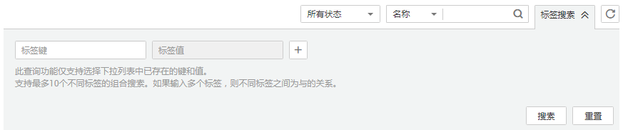
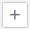

# 标签管理

标签是专属主机的标识。为专属主机添加标签，可以方便用户识别和管理拥有的专属主机资源。

您可以在创建专属主机时添加标签，也可以在专属主机创建完成后，在详情页添加标签，您最多可以给一台专属主机添加10个标签。

标签由两部分组成：“标签键”和“标签值”，其中，“标签键”和“标签值”的命名规则如[表1](#table204442131366)所示。

**表 1**  标签命名规则

|参数|规则|样例|
|--|--|--|
|标签键|不能为空。对于同一台专属主机，Key值唯一。长度不超过36个字符。只能包含数字、字母、“-”、“_”。|Organization|
|标签值|长度不超过43个字符。只能包含数字、字母、“-”、“_”。|Apache|

## 搜索目标专属主机

在专属主机列表页，您可以按“标签键+标签值”搜索目标专属主机。

1.  登录管理控制台。
2.  选择“计算 \> 专属主机”。
3.  单击专属主机列表右上角的“标签搜索”，展开查询页。

    **图 1**  按标签搜索  
    

4.  输入待查询专属主机的标签。

    标签键和标签值均不能为空，当标签键和标签值全匹配时，系统可以自动查询到目标专属主机。

5.  单击添加标签。

    系统支持不同标签的组合搜索，并取各个标签的交集。

6.  单击“搜索”。

    系统根据标签键或标签值搜索目标专属主机。

